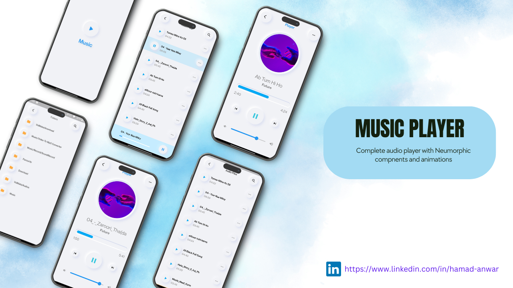

# Flutter Music Streaming Application

A Flutter music streaming application that allows users to play audio files from local storage. The app features a beautiful neumorphic UI design and provides a smooth user experience for browsing and playing music.

## Screenshots

Include some attractive screenshots of your app to give potential users a visual preview of your project's interface.

## Features

- Browse and display audio files from local storage.
- Neumorphic UI design for an elegant and modern look.
- Smooth animations enhance the user experience.
- Play audio directly from the list screen or access a dedicated player screen.
- Play, pause, skip, and control volume from the player screen.
- Minimalistic and intuitive user interface.

## Getting Started

These instructions will help you get a copy of the project up and running on your local machine for development and testing purposes.

### Prerequisites

- Flutter: Make sure you have Flutter installed. [Install Flutter](https://flutter.dev/docs/get-started/install)
- Clone this repository: `git clone https://github.com/yourusername/your-repo.git`
- Navigate to the project directory: `cd your-repo`

### Dependencies

This project uses the following dependencies:

- `get: ^4.6.5` - A package for state management and navigation in Flutter.
- `just_audio: ^0.9.34` - A powerful audio player for Flutter applications.
- `percent_indicator: ^4.2.3` - Displays progress indicators in a circular or linear style.
- `path_provider: ^2.0.15` - Provides access to the device's file system paths.
- `on_audio_query: ^2.9.0` - Fetches audio files from the device's storage and organizes them.
- `permission_handler: ^6.0.1` - Handles runtime permissions for accessing device features.
- `path: ^1.8.3` - Provides utilities for handling file and directory paths.
- `flutter_neumorphic: ^3.1.1` - Creates neumorphic-style UI components.
- `flutter_storage_path: ^1.0.4` - Retrieves storage paths for media files.

### Installing

1. Run `flutter pub get` to install the required dependencies.
2. Connect your device or start an emulator.
3. Run `flutter run` to launch the app.

## Contributing

Contributions are welcome! If you encounter bugs or have suggestions, please [open an issue](https://github.com/Hamad-Anwar/Neumorphic-Music_Player-Flutter) or submit a pull request. Follow these steps:

1. Fork the project.
2. Create your feature branch: `git checkout -b feature/new-feature`
3. Commit your changes: `git commit -am 'Add a new feature'`
4. Push to the branch: `git push origin feature/new-feature`
5. Open a pull request.

## Acknowledgments

- The neumorphic design was inspired by [Neumorphism.io](https://neumorphism.io/).
- Shoutout to the Flutter community for their support and resources.
## Contact

If you have any questions or suggestions regarding the Car Control Dashboard app, feel free to contact us at rh676838@gmail.com.

